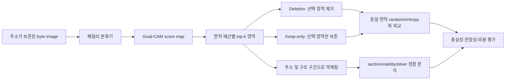

# 논문 설계서: 설명의 신뢰성을 평가하는 악성코드 이미지 분류

**프로토콜 식별자:** `XAI-V4.0-DRAFT`

**상태:** 결과 전 설계 초안

**권장 논문 유형:** 분류 + XAI 평가 소논문

**주 데이터:** BIG2015

**보조 데이터:** MaleVis 224×224

## 1. 제목

권장 국문 제목:

> 정확도를 넘어 설명의 신뢰성으로: 악성코드 바이트 이미지 분류기의 구조 정합 및
> 예산 기반 XAI 평가

권장 영문 제목:

> Beyond Accuracy: Evaluating Structure-Aligned and Budgeted Explanations for Malware Image Classification

Grad-CAM이 독립 근거보다 우수하고 구조 분석까지 완료된 경우 사용할 수 있는 강한 제목:

> 정확도를 넘어 설명 가능성으로: 구조 인지형 악성코드 이미지 분류 및 약지도 의심 구역 국지화

초기 초안의 “Maldataset-2021 및 경량 비전 모델을 중심으로”라는 부제는 데이터 결정을
확정하기 전에는 사용하지 않는다. ResNet-50은 약 25M parameter 규모이므로 이 연구에서
자동으로 `경량`이라고 부르지 않는다. 8 GB GPU에서 실행 가능하다는 것과 경량 모델이라는
주장은 별도다.

## 2. 연구 문제

악성코드 바이트 이미지는 파일 단위 family label만으로도 높은 분류 성능을 낼 수 있다.
그러나 분류 정확도는 모델이 보안 분석에 의미 있는 위치를 사용했음을 보장하지 않는다.
Grad-CAM도 붉은 히트맵을 생성한다는 이유만으로 실제 악성 코드, 패밀리 고유 구조 또는
분석가에게 유용한 증거가 되지 않는다.

본 연구는 위치 ground truth가 없는 조건에서 다음 세 질문을 검증한다.

- **RQ1:** Grad-CAM 상위 영역은 동일 면적의 무작위 또는 엔트로피 기반 영역보다
  패밀리 예측에 더 필요한가?
- **RQ2:** 상위 영역만 남겼을 때 모델의 정답 점수 또는 분류 성능이 동일 면적 대조군보다
  더 잘 보존되는가?
- **RQ3:** 모델 귀속 영역은 address-indexed byte image의 구조 구간과 일관된 관계를
  보이며, 이 관계는 seed·모델·교란 방식이 달라도 유지되는가?

SOREL 보조 분석을 수행할 경우에만 다음 질문을 추가한다.

- **RQ4:** 모델 귀속 영역은 embedded-PE 및 YARA silver interval과 chance보다 높은
  정합을 보이는가?

## 3. 주장 범위

본 연구가 직접 측정하는 대상은 `family-decision evidence`다. 히트맵은 모델의 출력에
기여한 입력 영역이며, 그 영역의 악성 의미를 자동으로 보증하지 않는다.

| 표현 | 사용 조건 |
|---|---|
| 모델이 주목한 영역 | Grad-CAM 산출물만 있어도 가능 |
| 분류에 필요한 영역 | deletion이 matched random보다 유의하게 클 때 가능 |
| 분류에 충분한 영역 | keep-only가 matched random보다 유의하게 우수할 때 가능 |
| 구조 정합 영역 | 주소/구조 map과 정량 비교했을 때 가능 |
| 악성 구역 | 독립적인 악성 위치 gold가 있을 때만 가능 |
| 분석시간 감소 | 분석가 시간 또는 실제 후속 분석 비용을 측정했을 때만 가능 |

## 4. 제안 프레임워크



### 4.1 이미지 표현

주 실험은 BIG2015 `.bytes`를 주소 순서대로 rasterize한 표현을 사용한다. 변환 과정에서
다음을 보존한다.

- 원주소와 raster index의 lookup
- 유효 바이트와 `??`/gap의 validity
- raster width와 padding 길이
- resize/crop/pad 방식
- source와 파생 이미지의 SHA-256

자연영상 augmentation인 horizontal flip, vertical flip, rotation은 바이트 순서와 주소
의미를 바꾸므로 사용하지 않는다. 밝기나 색상 jitter도 byte value를 바꾸므로 기본
실험에서 제외한다.

### 4.2 패밀리 분류기

주 모델은 ResNet-18로 한다. ResNet-50은 비교 모델로 한정한다.

- **Primary:** ResNet-18, ImageNet initialization과 random initialization을 별도 기록
- **Reference:** ResNet-50
- **Cheap baseline:** 기존 compact CNN 또는 histogram/bigram classifier

입력이 1-channel이면 첫 convolution을 1-channel로 바꾸거나 같은 grayscale 값을
3-channel로 복제하는 두 방법 중 하나를 validation에서 선택하고 동결한다. validity를
별도 channel로 넣으면 그 channel 자체가 family shortcut이 될 수 있으므로
valid-fraction matched 평가를 함께 수행한다.

배치 크기 32는 목표값일 뿐 고정된 안전값이 아니다. RTX 5070 8 GB에서 AMP를 켠 짧은
pilot로 peak VRAM을 측정하고, OOM 없이 최소 10% 여유가 남는 최대 배치를 사용한다.
batch 16 또는 gradient accumulation으로 바뀌어도 protocol record에 남긴다.

### 4.3 XAI와 예산 선택

Grad-CAM을 주 설명기로 사용하고 마지막 convolution block을 target layer로 고정한다.
ResNet-18과 ResNet-50은 서로 다른 공간 해상도의 CAM을 만들 수 있으므로 원본 raster로
올리는 interpolation 방법을 bilinear로 고정하고 `align_corners=False`를 기록한다.

정규화된 양의 CAM에서 상위 면적을 선택한다.

```text
budget ∈ {5%, 10%, 20%, 40%}
selected mask = top CAM pixels until the valid-byte area budget is reached
```

예산 분모는 전체 canvas가 아니라 **유효 입력 위치 수**로 한다. 연결요소를 박스로
바꾸는 것은 시각화를 위한 파생 표현이며, 평가는 pixel/address mask에서 한다.

비교군은 다음으로 제한한다.

- 동일 면적 random mask, sample당 반복
- entropy 상위 영역
- front-position 영역
- 필요하면 occlusion ranking을 고비용 reference로 사용

### 4.4 설명 검증

**Comprehensiveness/deletion:** 선택 영역을 제거한 뒤 정답 class의 NLL 증가 또는
확률 감소를 측정한다.

**Sufficiency/keep-only:** 선택 영역만 남긴 뒤 정답 class 점수와 정확도 유지율을
측정한다.

**AOPC:** budget 증가에 따른 실제 누적 mask 재추론 곡선의 면적을 계산한다. 개별 pixel
효과를 단순 합산하지 않는다.

**Sanity check:** 학습된 모델, label-shuffled 모델, random-weight 모델의 CAM을 비교한다.
학습 모델의 설명이 무작위 모델과 거의 같다면 시각적으로 선명해도 설명으로 인정하지
않는다.

**Stability:** 동일 sample에 대한 세 seed CAM의 rank correlation과 top-k IoU를
측정한다. 정확히 분류된 sample만 고르는 결과와 전체 test 결과를 모두 보고한다.

**Fill sensitivity:** 최소 두 방식으로 deletion을 반복한다.

- valid-byte histogram에서 뽑은 conditional fill
- local neighborhood 또는 blur 기반 fill

0x00 fill은 BIG2015의 무효 위치와 혼동될 수 있어 주 결과로 사용하지 않고 민감도
분석으로만 둔다.

### 4.5 구조 정합 분석

구조 정합은 Grad-CAM을 구조 인지형으로 만드는 학습 기법이 아니라, 설명 결과가 구조와
어떻게 대응하는지 측정하는 분석이다. BIG2015 `.asm`에서 안정적으로 복원 가능한 구간에
대해 다음 값을 보고한다.

- 각 구조 구간에 들어간 CAM positive mass 비율
- 구간 면적을 고려한 enrichment: `CAM mass fraction / valid-area fraction`
- header/front, code-like, data/resource-like, unknown/gap 구간별 분포
- family별 분포와 seed 간 변동
- validity fraction, entropy, 위치와 CAM score의 상관

SOREL 분석을 수행하면 PEAtlas의 file offset/RVA/VA/pixel map을 사용하되 embedded PE와
YARA source를 합치지 않고 별도 보고한다.

## 5. 데이터 분할

분할은 파생 이미지를 만든 뒤 임의로 섞지 않는다.

1. 원 source ID와 hash를 기준으로 exact duplicate를 제거한다.
2. 가능한 경우 fuzzy/perceptual similarity로 near-duplicate group을 만든다.
3. group 전체를 train/val/test 중 하나에만 배치한다.
4. class 비율을 유지하되 test는 마지막까지 잠근다.
5. 모델, target layer, budget, fill, threshold는 val에서 결정한다.
6. test를 본 뒤 바꾼 설정은 exploratory revision으로 분리한다.

기본 비율은 group-stratified 70/15/15다. 공식 test split의 독립성이 확인되는 데이터는
공식 split을 우선한다.

## 6. 지표

### 분류

- accuracy
- macro-F1
- balanced accuracy
- MCC
- class별 recall
- confusion matrix
- ECE와 NLL

### 설명 충실성

- deletion ΔNLL 및 Δprobability
- keep-only NLL 및 prediction retention
- top-k 대 random의 paired difference
- cumulative deletion/keep-only AOPC
- 설명 면적 및 연결요소 수

### 안정성 및 구조

- seed 간 Spearman rank correlation
- top-k IoU
- 구조 구간별 CAM mass와 area-normalized enrichment
- validity, entropy, normalized position과 CAM score의 상관
- 선택적 silver byte recall/precision

### 비용

- 이미지 변환 시간
- 분류 forward latency
- Grad-CAM backward latency
- budget mask 및 역매핑 시간
- peak VRAM

분석가 시간은 측정하지 않으므로 “리버싱 시간 단축”은 결과 지표에 포함하지 않는다.

## 7. 주 검정과 성공 게이트

Primary budget은 10%로 고정한다.

- **G0 분류 sanity:** test를 열기 전에 val macro-F1이 majority baseline을 최소 10%p
  초과하고, 모든 class에 예측이 존재한다.
- **G1 necessity:** test의 Grad-CAM top-10% deletion ΔNLL이 matched random보다 크고,
  file-level paired bootstrap 95% CI가 0을 제외한다.
- **G2 sufficiency:** top-10% keep-only의 정답 점수가 matched random보다 높고 paired
  bootstrap 95% CI가 0을 제외한다.
- **G3 sanity:** trained-model CAM이 random-weight 및 label-shuffled CAM보다 높은
  faithfulness를 보인다.
- **G4 stability:** seed별 효과 방향이 일치하고, 평균만으로 반대 seed를 숨기지 않는다.

G1과 G2가 모두 통과해야 `faithful candidate region`이라고 부른다. 하나만 통과하면
필요성 또는 충분성 중 해당 속성만 주장한다. 둘 다 실패하면 XAI 한계 평가 논문으로
전환한다. 구조 정합이나 silver overlap만으로 G1/G2 실패를 덮지 않는다.

## 8. 통계

- 분석 단위는 파일이다.
- 같은 파일의 Grad-CAM과 random 결과를 paired comparison으로 계산한다.
- random은 sample당 최소 20회 반복하고 평균과 분산을 기록한다.
- file-level paired bootstrap 2,000회를 기본으로 한다.
- primary test는 10% budget의 G1/G2 두 개이며 Holm 보정을 적용한다.
- 5/20/40%와 family별 결과는 secondary/exploratory로 표시한다.
- 3개 seed는 각각 보고하고 seed 평균도 별도로 제시한다.
- 정확 분류 sample과 전체 test 결과를 둘 다 제시한다. 성공 sample만으로 주 결과를
  만들지 않는다.

## 9. 최소 실험 행렬

| 데이터 | 모델 | 설명/선택 | seed | 목적 |
|---|---|---|---:|---|
| BIG2015 | ResNet-18 | Grad-CAM | 3 | 주 결과 |
| BIG2015 | ResNet-18 | random, entropy, front | 동일 | matched controls |
| BIG2015 | compact CNN 또는 text model | occlusion 또는 feature baseline | 1–3 | 모델·표현 교차검증 |
| BIG2015 | ResNet-50 | Grad-CAM | 1 | backbone ablation |
| MaleVis 224 | ResNet-18 | Grad-CAM/random | 1 | 선택적 외부 이미지 기준선 |
| SOREL pilot | behavior model | CAM/silver | 1 | 선택적 탐색 분석 |

마감이 촉박하면 첫 두 행과 cheap baseline만 수행한다. ResNet-50, MaleVis, SOREL을
완료 조건으로 두지 않는다.

## 10. 예상 결과를 쓰는 규칙

“95% 이상 쉽게 달성된다”, “패밀리별 구조를 성공적으로 학습했다”, “분석 범위를 대폭
축소했다”와 같은 문장은 결과 전 초안에서 삭제한다. 결과 절에는 다음 세 분기가 있다.

1. **G1/G2 통과:** 예산 제한 설명이 matched control보다 충실하다는 제한된 긍정 결과
2. **일부 통과:** 필요성과 충분성의 비대칭, 구조·모델별 조건부 결과
3. **모두 실패:** 시각적으로 선명한 Grad-CAM과 인과적 충실성이 다르다는 negative result

세 분기 모두 논문 결론이 되도록 초안을 작성한다.

## 11. 기여

결과 전 단계에서 제안할 수 있는 기여는 다음 세 가지다.

1. 악성코드 이미지 Grad-CAM을 동일 면적 control과 실제 재추론으로 검증하는 예산 기반
   평가 프로토콜
2. validity와 주소 역매핑을 보존해 설명을 입력 구간 및 구조 구간으로 환산하는 절차
3. 정확도, 충실성, 안정성, 구조 정합성, 비용을 분리 보고하는 재현 가능한 실험 설계

새 XAI 알고리즘을 만들지 않는다면 “새로운 Grad-CAM 방법”을 기여로 쓰지 않는다.
